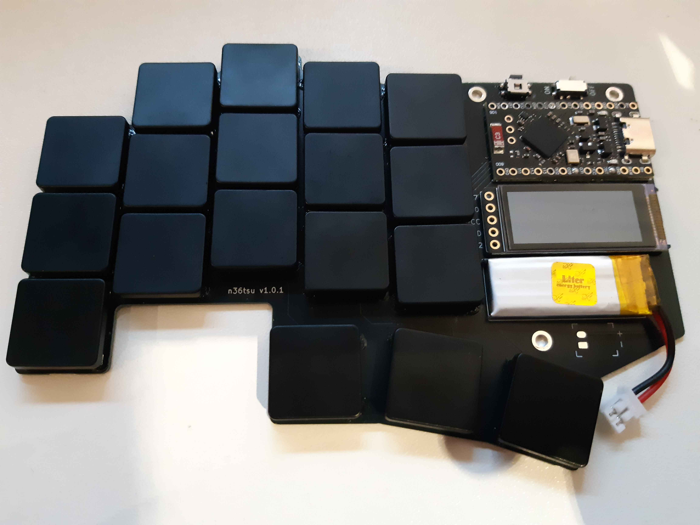
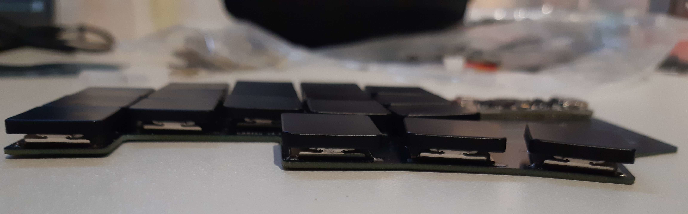
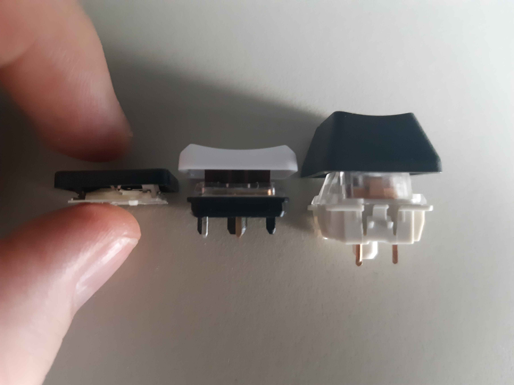

## n36tsu keyboard

- 36 keys
- PG1316S
- nice!view
- nice!nano
- wireless

## TODO

- [x] modify footprints to solder-on
- [x] verify every components orientation
- [x] add text on PCB
- [x] add case holes
- [x] wire components
- [ ] design 3D case
